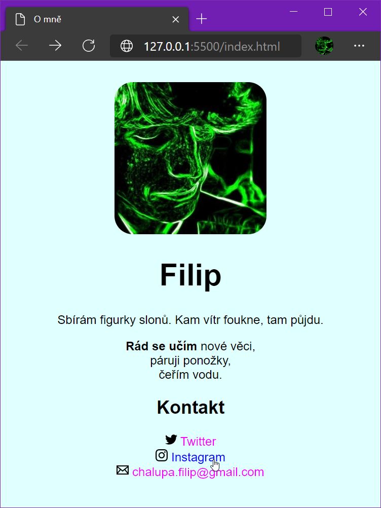

# [GitHub.com](https://github.com/)

- Webová nadstavba nástroje _Git_
- Nástroj pro správu verzí vašeho projektu
- Týmová spolupráce
- Údržba a rozvoj projektu

## Slovníček

- repozitář
- klonovat
- commit
- push

## Repozitář/repository

- Úložiště právě jednoho projektu
- De facto složka s vaším projektem

## Klonovat/clone

- Vytvořit duplikát repozitáře
- Typicky si naklonujeme repozitář z GitHubu k sobě na počítač

## Commit

- Commit = souhrn změn v našem projektu
- Commit message: popis těchto změn
- Commit ~ závazat se, spáchat, předat
- Doporučuje se commitovat často, nicméně záleží na vás
- Commit message stručně, při týmové spolupráci kolegové ocení vysvětlení, proč jste ty změny provedly
- Kolegou, který to ocení, můžeš být i ty sama – za 2 měsíce

## Push

- Odeslání commitů na vzdálený server (pro nás GitHub.com)
- Dokud jsou soubory u mě na počítači, mám nad nimi plnou kontrolu
- Jakmile je _pushnu_ už se případné opravy a výmazy provádějí mnohem hůř
- Tím se ale netrapte, commitujte a pushujte jak libo
- _push_ je svým způsobem záloha

## Cvičení 1

- Zaregistrujte se na [github.com](https://github.com/)
- Vytvořte si ve svém GitHub účtu repozitář s názvem `vizitka`
- Otevřete nové okno VS Code (`File>New Window`)
- V levé liště zvolte ikonku větvičky (Source Control)
- Pomocí `Clone Repository>Clone from GitHub` propojte VS Code s GitHubem a zvolte příslušný repozitář
- Jako cílové umístění pro repozitář zvolte již existující složku s projekty (`html_a_css_1`).
- Po výzvě v pravém dolním rohu nově naklonovaný repozitář ve VS Code otevřete

_Poznámka: Pokud vám bude chybět program git, doinstalujte ho pro Windows z [gitforwindows.org](https://gitforwindows.org/) nebo na Macu otevřením aplikace Terminal a zadáním `git --version` + `Enter`._

- Vytvořte soubor `index.html`
- Kromě základní html struktury přidejte nadpis s vaším jménem
- V Source Control pojmenujte změny například jako `Základ` nebo `Initial commit`.
- Najeťte myší kousek nad řádek pro `Message`
- Objeví se několik ikonek a tři tečky
- Ve třech tečkách zvolte `Push` pro nahrání commitu na GitHub
- Pravděpodobně na vás vyskočí okno s přihlášením do GitHubu
- Zadejte váš e-mail a heslo
- Zkontrolujte, že `index.html` je i v internetovém prohlížeči na GitHubu

## GitHub Pages

- Svůj repozitář můžeme za určitých okolností rovnou vystavit na web
- Musí být veřejný (public)
- V `Settings` v sekci `Pages` v části `Source` vyberu `master` nebo `main` a dám `Save`
- Stránka se obnoví a na témže místě naleznu odkaz na web se svým projektem
- Kdykoli pushnu, automaticky se (po chvíli) změny propíšou i do webu (nasadí se, anglicky deploy)

## Cvičení 2

- Nastavte pro repozitář s vizitkou GitHub Pages
- Doplňte do html další obsah a nastylujte ho
- Nezapomeňtě průběžně commitovat a pushovat
- Výsledek může vypadat například takto:

	

- Zkontrolujte, že veškerý kód se opravdu nahrál i na GitHub a stránka je veřejná díky GitHub Pages
